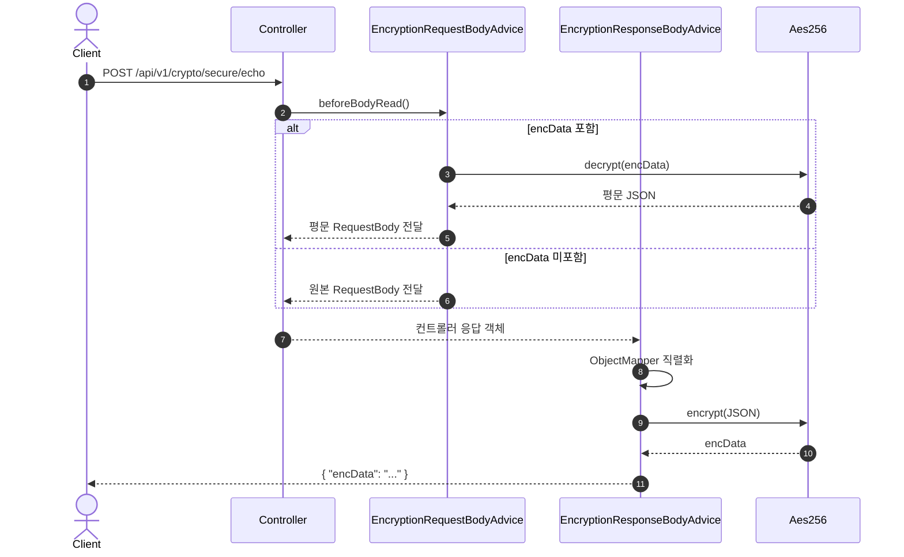

# 암호화/복호화 테스트 API 가이드

## 목적
- AES 암호화/복호화 테스트용 API 사용법 정리
- CCC 암복호화 어드바이스 경로 검증

## 대상 엔드포인트
- `POST /api/v1/crypto/encrypt`
- `POST /api/v1/crypto/decrypt`
- `POST /api/v1/crypto/secure/echo` (CCC 암복호화 파이프라인)

## 사전 설정
- `app.security.encryption.enabled=true`
- `app.security.encryption.key`, `app.security.encryption.iv` 설정 필수

> 실제 키/IV는 보안 정책에 따라 별도 관리합니다. 이 문서에는 민감정보를 포함하지 않습니다.

## 사용 흐름

### 1) 평문 → encData 생성
- 요청 (예시)
  - `{ "plainText": "hello-ccc" }`
- 응답 (예시)
  - `{ "success": true, "message": "암호화 성공", "data": { "encData": "BASE64_AES_ENCRYPTED_PAYLOAD" }, "timestamp": "..." }`

### 2) encData → 평문 복호화
- 요청 (예시)
  - `{ "encData": "BASE64_AES_ENCRYPTED_PAYLOAD" }`
- 응답 (예시)
  - `{ "success": true, "message": "복호화 성공", "data": { "plainText": "hello-ccc" }, "timestamp": "..." }`

### 3) CCC 암복호화 파이프라인 확인
- 평문 요청 (예시)
  - `{ "message": "hello-ccc", "payload": { "tenantDbid": 1 } }`
- 암호화 요청 (예시)
  - `{ "encData": "BASE64_AES_ENCRYPTED_PAYLOAD" }`
- 암호화 응답 (예시)
  - `{ "encData": "BASE64_AES_ENCRYPTED_RESPONSE" }`

## 시퀀스 다이어그램 (요청/응답 암복호화)

## 테스트 팁
- 암호화 샘플 생성은 먼저 `/api/v1/crypto/encrypt`로 수행
- 생성된 `encData`를 CCC 암복호화 엔드포인트에 그대로 입력
- 응답이 `encData` 형태로 내려오면 어드바이스 동작 정상

## 주의사항
- `encData`는 Base64 문자열이며, 동일 키/IV에서만 복호화 가능
- 키/IV가 변경되면 기존 `encData`는 복호화 실패
